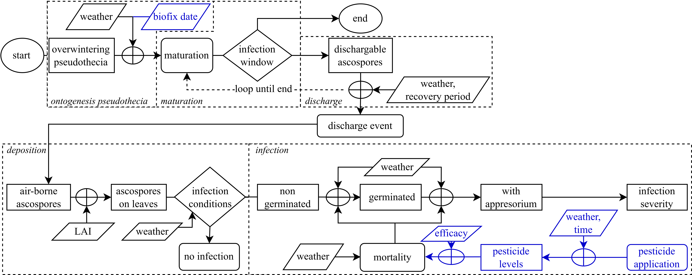

## A-scab

Gymnasium Environment for Apple Scab Model (A-scab)

The environment is designed based on the A-scab model described in Rossi et al. (2007) [1].

The A-scab model simulates the development of pseudothecia, ascospore maturation, discharge, deposition,
and infection throughout the season. The simulation uses hourly weather data to predict these processes.
The model produces a severity index for each infection period.


*Figure 1: Flow diagram of A-scab model.*

The observation space comprises three elements:
1. The state of the tree (e.g. LAI)
2. The state of the fungus (e.g. Progress of infection)
3. The state of the weather (e.g. LeafWetness)

The action space comprises the amount of pesticide to spray, affecting the mortality rate of the fungus.


## Installation

```
pip install ascab@git+https://github.com/WUR-AI/A-scab
```

## References
[1] Rossi, V., Giosue, S., & Bugiani, R. (2007). A‐scab (Apple‐scab), a simulation model for estimating
risk of Venturia inaequalis primary infections. EPPO Bulletin, 37(2), 300-308.